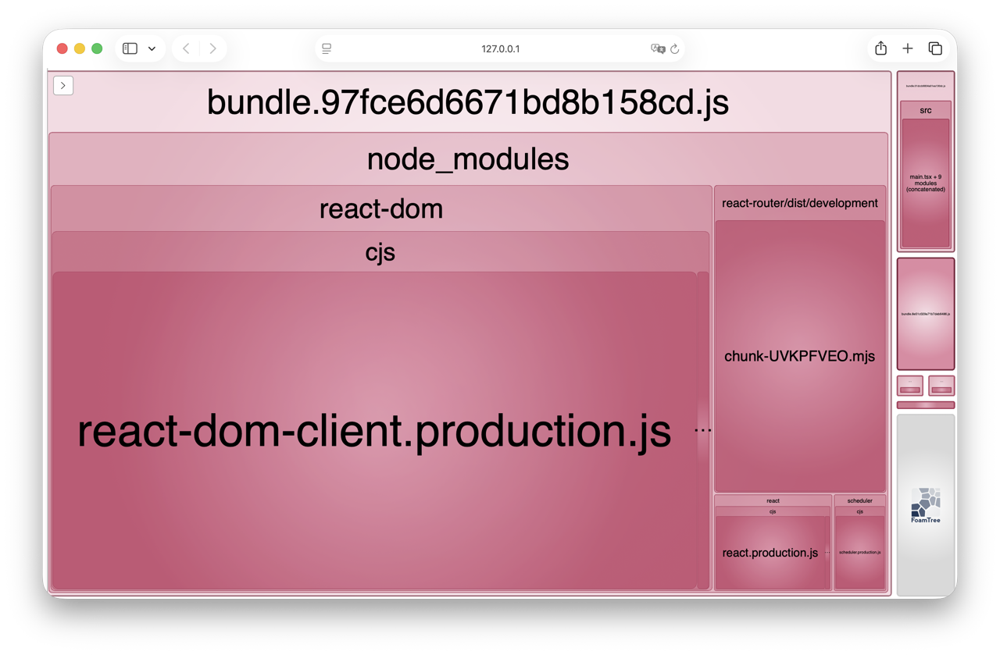
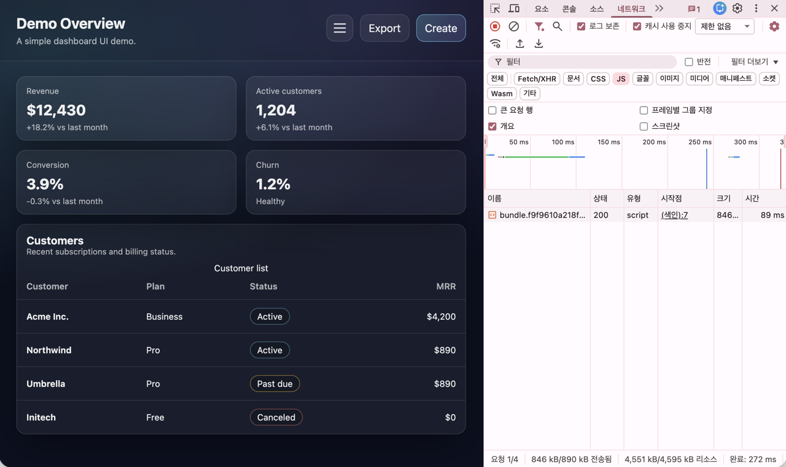
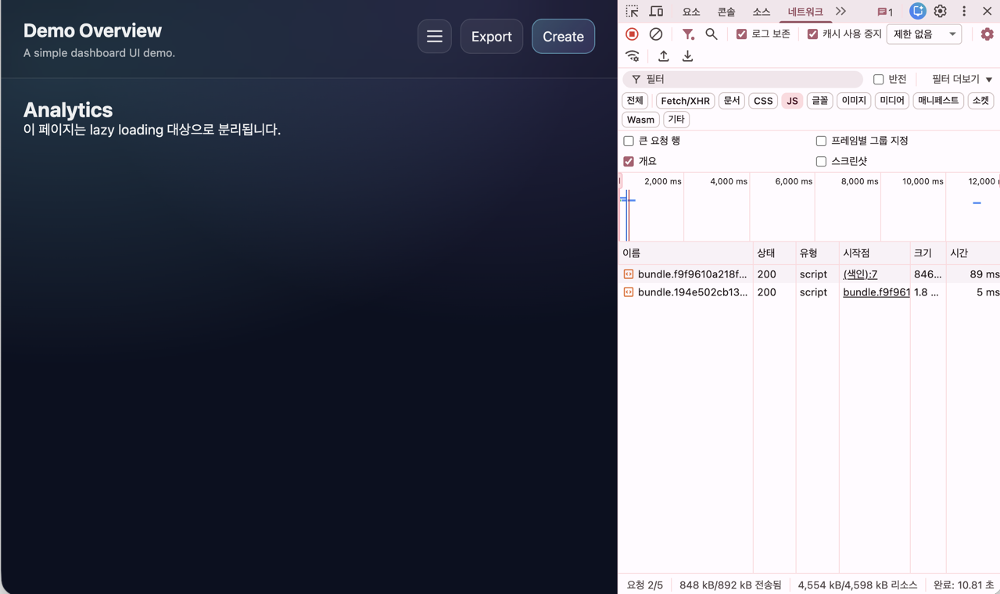

# React Webpack Starter

Webpack 기반으로 React 개발 환경을 직접 구성하고, `React.lazy`, `dynamic import`, `splitChunks`를 적용해 라우트 단위 코드 스플리팅과 번들 구조를 검증한 React 스타터 프로젝트입니다.

단순히 React 앱을 실행하는 데서 그치지 않고, 개발 서버 구성, 번들링, 청크 분리, SPA 라우팅 처리, 환경변수 정책까지 직접 설계하고 검증하는 것을 목표로 했습니다.

## 1. 프로젝트 소개

이 프로젝트는 Webpack 기반 React 스타터를 직접 구성하고, 라우트 단위 lazy loading과 공통 청크 분리 전략을 적용해 초기 번들과 비동기 청크의 분리 및 로딩 흐름을 확인하기 위해 만든 데모 프로젝트입니다.

대시보드 형태의 샘플 UI를 구성해 라우트 전환과 청크 로딩 흐름을 시각적으로 검증했으며, 템플릿 단계에서부터 개발/운영 환경 분리와 클라이언트 환경변수 공개 정책까지 함께 고려했습니다.

## 2. 기획 배경

CRA나 Vite 같은 도구를 사용하면 React 개발 환경을 빠르게 시작할 수 있지만, 애플리케이션이 실제로 어떤 방식으로 번들링되고, 개발/운영 환경이 어떻게 분리되며, 라우트 기반 코드 스플리팅이 어떤 흐름으로 동작하는지 직접 체감하기는 어렵다고 느꼈습니다.

그래서 이 프로젝트에서는 Webpack 설정을 직접 구성하면서 다음과 같은 내용을 이해하고자 했습니다.

- React 애플리케이션이 어떤 방식으로 빌드되는지
- 개발 서버와 production build의 역할이 어떻게 다른지
- `React.lazy`와 `import()`가 실제 번들 분리에 어떤 영향을 주는지
- `splitChunks`를 통해 공통 의존성이 어떻게 분리되는지
- SPA에서 직접 URL 접근 시 왜 별도 fallback 설정이 필요한지
- 환경변수를 어떤 기준으로 분리하고, 클라이언트에 어떤 값만 노출해야 하는지

## 3. 프로젝트 목표

이 프로젝트의 주요 목표는 다음과 같습니다.

- Webpack 기반 React 개발 환경을 처음부터 직접 구성한다.
- 개발 환경과 운영 환경 설정을 분리한다.
- React Router를 이용해 SPA 라우트 구조를 구성한다.
- `React.lazy(() => import(...))`를 적용해 route-based code splitting을 구현한다.
- `splitChunks`를 적용해 공통 의존성을 별도 청크로 분리한다.
- Bundle Analyzer와 브라우저 Network 탭을 통해 번들 구조와 청크 로딩 흐름을 검증한다.
- 환경변수 파일 구조와 클라이언트 공개 정책을 함께 설계한다.
- 이후 custom plugin 등으로 확장 가능한 빌드 환경의 기반을 마련한다.

## 4. 주요 구성

- React + TypeScript + Webpack 최소 실행 환경
- CSS / 이미지 asset 처리
- common / dev / prod 설정 분리
- React Router 기반 대시보드 데모 라우팅
- `@/* -> src/*` alias 지원
- `.env`, `.env.local`, `.env.[mode]`, `.env.[mode].local` 구조 지원
- `APP_PUBLIC_` prefix 기반 공개 환경변수 정책
- `React.lazy(() => import(...))`를 사용해 페이지 단위 lazy loading 적용
- `splitChunks` 기반 공통 청크 분리
- `webpack-bundle-analyzer`를 통한 번들 시각화
- SPA 직접 진입 대응을 위한 fallback 설정

## 5. 기술 스택

- React
- TypeScript
- Webpack
- React Router
- CSS
- Webpack Bundle Analyzer

## 6. 프로젝트 구조

```bash
src
├─ assets
├─ components
├─ layouts
├─ pages
├─ styles
├─ types
├─ App.tsx
└─ main.tsx

config
├─ webpack.common.js
├─ webpack.dev.js
└─ webpack.prod.js
```

- assets : 이미지 등 정적 리소스
- components : 공통 UI 컴포넌트
- layouts : 대시보드 공통 레이아웃
- pages : 라우트 단위 페이지 컴포넌트
- styles : 전역 및 페이지 스타일
- types : CSS / SCSS / 정적 리소스 타입 정의
- config : 공통 / 개발 / 운영 환경별 Webpack 설정 파일

## 7. 실행 방법

```bash
npm install
npm run dev
npm run build
npm run analyze
```

- `npm install`: 의존성 패키지 설치
- `npm run dev` : 개발 서버 실행
- `npm run build` : production 번들 생성
- `npm run analyze` : 번들 분석 도구 실행

## 8. Webpack 설정 요약

이 프로젝트에서는 Webpack 설정을 공통 / 개발 / 운영 환경으로 분리해 관리했습니다.

### 공통 설정

- React + TypeScript 번들링
- CSS 및 정적 리소스 처리
- `@/* -> src/*` alias 설정
- `.env` 계열 파일 로딩 및 공개 환경변수 주입 정책 적용
- HTML 템플릿 연결
- 번들 출력 경로 및 파일명 설정

### 개발 환경 설정

- `webpack-dev-server` 기반 개발 서버 구성
- HMR 적용
- `historyApiFallback` 설정으로 SPA 직접 진입 시 404 방지
- 브라우저 자동 실행 지원

### 운영 환경 설정

- `production` mode 기반 최적화
- output 디렉토리 정리
- `splitChunks` 기반 공통 청크 분리
- `runtimeChunk: "single"` 적용
- `MiniCssExtractPlugin`을 통한 CSS 별도 추출
- 필요 시 Bundle Analyzer를 통한 번들 분석 지원
- 실제 배포 환경에서는 별도 rewrite 설정이 필요함을 고려

## 9. Code Splitting과 Bundle 분석

```tsx
const Analytics = lazy(() => import("./pages/Analytics"));
const Customers = lazy(() => import("./pages/Customers"));
const Settings = lazy(() => import("./pages/Settings"));
```

각 페이지를 `React.lazy(() => import(...))` 형태로 분리해, 초기 번들에 모든 화면 코드를 포함하지 않고, 해당 라우트에 진입하는 시점에 필요한 청크만 로드하도록 구성했습니다.

또한 `splitChunks`를 설정해 공통 의존성이 별도 청크로 분리되도록 구성했고, production 빌드에서는 CSS를 별도 파일로 추출해 초기 JS 번들에 스타일 코드가 과도하게 포함되지 않도록 개선했습니다.

이후 다음 방식으로 분리 결과를 검증했습니다.

- **Bundle Analyzer**
  
  - 초기 번들, 공통 청크, 라우트별 비동기 청크가 분리되는지 확인
  - 초기 엔트리 번들에 포함된 주요 코드가 무엇인지 확인
- **브라우저 Network 탭**

  <table>
    <tr>
      <td align="center"></td>
      <td align="center"></td>
    </tr>
    <tr>
      <td align="center"><b>Before</b></td>
      <td align="center"><b>After</b></td>
    </tr>
    <tr>
      <td align="center">홈 진입 시 초기 청크만 로드된 상태</td>
      <td align="center">특정 라우트 진입 시 해당 페이지 청크가<br />추가 요청된 상태</td>
    </tr>
  </table>

### 확인한 내용

- `Analytics`, `Customers`, `Settings` 페이지가 개별 청크로 분리됨
- 특정 라우트에 처음 진입할 때만 lazy import가 실행됨
- 한 번 로드된 청크는 동일 세션 내에서 재요청 없이 재사용되어 이후 이동 시 더 빠르게 렌더링되는 것을 확인함
- 라우트별로 `Suspense`를 배치했을 때, 페이지 전환 시 fallback UI를 더 명확하게 제어할 수 있음을 확인함
- Bundle Analyzer를 통해 초기 엔트리 번들에는 `react-dom`, `react-router`, 공통 앱 코드가 주로 포함됨을 확인함
- CSS를 별도 파일로 추출한 뒤 entrypoint size warning이 해소되고, `dist`에 CSS 파일이 생성되는 것을 확인함

## 10. Environment Variables 정책

Webpack 설정에서 환경변수 로딩과 공개 범위를 함께 제어해, 템플릿 단계에서부터 실행 환경 분리와 클라이언트 공개 정책을 일관되게 유지할 수 있도록 구성했습니다.

이 템플릿은 다음과 같은 환경변수 파일 구조를 지원합니다.

```txt
.env
.env.local
.env.[mode]
.env.[mode].local
```

위 구조를 통해 공통 설정, 로컬 전용 설정, 실행 모드별 설정을 분리할 수 있도록 했습니다.

또한 클라이언트 코드에는 `APP_PUBLIC_` prefix가 붙은 환경변수만 노출되도록 설계해, 브라우저에서 참조 가능한 값과 서버 전용 값을 명확히 구분할 수 있도록 했습니다.

예를 들면 다음과 같습니다.

- `APP_PUBLIC_TITLE` ✅
- `APP_PUBLIC_API_BASE_URL` ✅
- `SECRET_SERVER_KEY` ❌

이 정책을 통해 다음과 같은 기준을 유지할 수 있습니다.

- 브라우저 노출 허용 값만 명시적으로 공개
- 민감한 환경변수의 무분별한 클라이언트 주입 방지
- 실행 환경별 설정 분리를 고려한 템플릿 구조 확보

## 11. 관련 문서

- [Webpack 설정 결정 기록](./docs/webpack-decisions.md)
- [트러블슈팅 기록](./docs/troubleshooting.md)

## 12. 회고

이 프로젝트를 통해 React 애플리케이션을 단순히 사용하는 수준을 넘어, 빌드 도구와 번들링 구조를 직접 설계하고 검증하는 경험을 할 수 있었습니다.

특히 다음과 같은 점을 배울 수 있었습니다.

- Webpack 설정은 단순한 도구 사용이 아니라, 애플리케이션 구조와 로딩 전략까지 함께 설계하는 작업이라는 점
- `React.lazy`와 `Suspense`는 단순 문법이 아니라, 코드 분리와 사용자 경험을 함께 고려해야 하는 요소라는 점
- 코드 스플리팅은 “분리했다”로 끝나는 것이 아니라, Analyzer와 Network 탭을 통해 실제로 검증해야 의미가 있다는 점
- SPA 라우팅은 클라이언트 코드만으로 끝나지 않고, 개발 서버와 운영 서버 설정까지 함께 이해해야 한다는 점
- 환경변수 관리 역시 단순한 값 주입이 아니라, 실행 환경 분리와 보안 관점을 함께 고려해야 한다는 점

## 13. 확장 가능 방향

- custom plugin 예제 추가
- chunk naming 전략 개선
- prefetch / preload 실험
- not found route 및 에러 처리 구조 추가
- 배포 환경별 rewrite 설정 문서화
